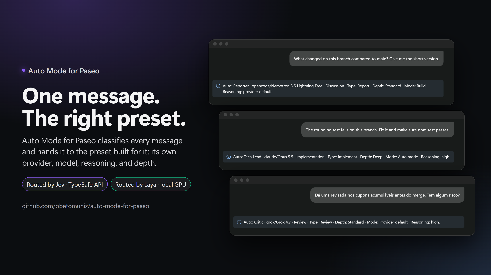

> [!NOTE]
> This project is an experiment. It explores what System 1 models can do as
> message routers. A System 1 model gives a fast, intuitive answer without
> step-by-step reasoning. TypeSafe Jev and Laya are System 1 models.
> Here, one of them only classifies each message and selects a preset.
> It does not read your code or plan the work, so it can select the wrong preset.
> Do not use this plugin in production. Examine each routing notice, and select
> a preset manually when the choice is important.

# Auto Mode for Paseo



Auto Mode for Paseo is a [Paseo](https://github.com/getpaseo/paseo) plugin.
It reads each new message and sends it to the best preset for the task.
Each preset has its own provider, model, reasoning setting, and instructions.
A preset can use Codex, Claude, OpenCode, or another provider installed in Paseo.
TypeSafe Jev or a local Laya model classifies the message.

The conversation picker contains Auto and preset names. Model names stay in
the plugin settings. Paseo owns workspaces and native provider authentication.
The default presets start with Codex models. You can change the provider of
each preset. Codex is necessary only for presets that use it.

## Requirements

- Paseo 0.8.0 or later with plugins enabled.
- Node.js 24 and npm.
- An installed and authenticated Paseo provider for each enabled preset.
- For Codex presets only: Codex CLI 0.153.4 or a compatible version, with a local login.
- For Jev: a TypeSafe API key.
- For Laya: no separate Python installation is needed on Windows.

## Install

Clone this repository. Then run these commands in the project directory:

```sh
npm ci
npm run check
paseo plugin install .
```

On Windows, use `npm.cmd` if PowerShell blocks `npm.ps1`.

If `paseo` is absent from PATH on Windows, use the project's launcher:

```powershell
npm.cmd run plugin:install
npm.cmd run plugin:status
npm.cmd run plugin:reload
```

The launcher checks `PASEO_CLI`, then PATH, then the Paseo Desktop installation
under `LOCALAPPDATA`. Use `npm.cmd run paseo -- --help` for other commands.
Set `PASEO_CLI` to the CLI file if Paseo is installed in a different location.
If the agent sandbox blocks the installation, use a supported read grant or
run the affected command through the host's approval flow. The same applies
when `gh` cannot access the user's existing GitHub login from the sandbox.
No credentials are copied into the project.

Open **Settings > Plugins > Auto Mode for Paseo**.
Select a classifier. Jev remains the default for existing settings.
Valid changes save automatically after a short pause in typing.
Invalid fields show an inline error. Other valid changes can still save.

### Jev

Select **Jev (TypeSafe API)**. Enter the TypeSafe API key.
Click **Save** beside the key to apply it. Click **Cancel** to discard the key edit.
Other setting changes never submit an unconfirmed key.
You can also set `TYPESAFE_API_KEY` in the Paseo daemon environment.
The key and Jev model fields appear only when Jev is selected.

### Laya (experimental)

On Windows, run the local installer from the plugin directory:

```powershell
npm.cmd run laya:install -- -Device cuda
```

The installer downloads Python 3.12 into `.laya-python`, creates `.venv-laya` and `.laya-cache`,
installs `laya==0.3.5`, installs the CUDA build of PyTorch when selected, preloads the chosen model, and saves the
Laya settings for the Paseo daemon. Both directories stay inside the plugin and
are ignored by Git. Use `-Device auto` to let PyTorch choose the device. Use
`-Device cpu` when no compatible NVIDIA GPU is available.

The first install downloads the Python runtime, PyTorch, Laya dependencies, and
the selected Hugging Face model. It can take several minutes. The plugin starts
the cached model on later turns.

On macOS or Linux, create a Python environment in the project directory:

```sh
python3.12 -m venv .venv-laya
.venv-laya/bin/python -m pip install laya==0.3.5
```

Select **Laya (local, experimental)** in plugin settings when the installer is
not used. Set **Python executable** and **Model cache** to the absolute paths for that environment.
Do not include shell commands or arguments.
Select **Multilingual** for Portuguese. Select **English** for English-only work.
Use **Typed decisions** only when evaluating that specialized checkpoint.
Choose **CPU**, **CUDA**, or **Automatic** as the device.
An explicit device mismatch stops the turn.
Save the settings. Send a short message to load the model.

The first load downloads model files from Hugging Face.
The model stays loaded between classifications until the plugin unloads,
the Laya configuration changes, or classification fails.
Startup has a 120-second limit. Inference has a 30-second limit. Preload the
model before the first Paseo turn when manual installation takes longer than the startup limit.

Laya does not require a TypeSafe key. A saved key stays stored when switching
classifiers. The plugin does not pass it to Laya. A Laya failure stops the turn.
It never sends the request to Jev as a fallback.

Laya quality for this routing task has not been benchmarked. Its confidence
score is not a guarantee of correct intent. Evaluate representative requests
in your language before using it for unattended work.
Both classifiers can misjudge scope or task depth. Overlapping scopes can be ambiguous.
Jev is the recommended classifier for Auto preset selection. In local smoke tests
with the default presets and two custom presets, Jev selected the expected preset
in 16 of 18 requests and Laya in 14 of 18. Jev tagged 12 of 12 sample scopes
correctly and Laya 10 of 12.
Routing tests validate selection rules. They are not an accuracy benchmark.
See the [Laya limitations](https://github.com/NandhaKishorM/laya#honest-limits).

### Presets

Open **Settings > Plugins > Auto Mode for Paseo**.
Click **Refresh** to load the providers and models available on this daemon.
Choose a provider for each preset. Select a model from **Available models**.
Choose a supported reasoning setting. Select **Provider default** to use the model's default.
Edit the instructions and description. Valid changes save automatically.
A model release does not require a plugin update.

| Preset | Automatic role |
| --- | --- |
| Tech Lead | Code delivery, debugging, and implementation validation |
| Staff | Technical strategy, architecture, and consequential tradeoffs |
| Critic | Reviews, critiques, and validation of existing work |
| Reporter | Facts, progress, changes, and open questions |
| Writer | Prose, documentation, explanations, and user-facing text |

Each preset has its own settings block. You can rename, disable, or remove any
preset, including the defaults. Complete a new preset's required fields to save it.
An incomplete new preset stays local while you edit it.
The initial presets are Tech Lead, Staff, Critic, Reporter, and Writer. They are editable starting points.
With the initial scopes, "Are these changes good?" fits Critic and "What changed?" fits Reporter.
No preset name or ID has special routing behavior.

Edit **Scope** to define when Auto should use a preset. Include its responsibility,
examples, and limits. The full scope stays visible in a multiline field.
Auto sends the complete scope of each enabled preset to Jev or Laya.
The limits are 240 characters for each scope and 32 presets. Names and IDs do not influence selection.
Instructions, model, provider, and reasoning settings do not influence role selection.
Edit **Instructions** to tell the selected model how to work.

**Used for** assigns each preset to fixed task types: Review, Implement, Design,
Report, Write, or Other. When you stop editing a Scope, the settings screen asks
the configured classifier to detect the type. Select types to set them manually.
Use **Detect from scope** to return to detection. A preset with an edited scope
and no current detection is untagged and competes for every task type.

Set **Task depth** to the most demanding work the configured setup can handle:
Light, Standard, Deep, or Expert. Jev/Laya estimates the required depth from the
request, recent context, and aggregate workspace change counts. A short question
about a large change can require a deep review. Size alone does not imply difficulty.
This field is separate from the provider's **Reasoning effort** setting.
Review task depth when changing a preset's model. The plugin does not infer model capability.

For each message, Jev/Laya also chooses one task type. Auto compares scopes only
among the presets used for that type and untagged presets. A higher scope score
cannot send a review to a writing preset. When no preset is used for the type,
all presets compete and the turn summary reports that. Other never reports it.
Auto selects the highest scope score among those presets that support the required depth.
When none supports it, Auto uses the deepest available setup and reports that limit.
Low scores do not block short or generic messages such as "testing" or "hello".
Equal scores prefer the lowest sufficient depth, then stable preset ID order.
If no enabled preset has a scope, Auto asks you to configure one or choose manually.
Leave a scope empty to make that preset available only for manual selection.
Disabled or deleted presets are excluded. Manual selection takes priority.
Default and custom presets use the same selection rules, including after renaming.
Previous routing thresholds no longer apply.

Use **Restore** to add deleted defaults back.
This action keeps your existing presets and their settings.
Saving settings does not restore deleted presets.

The selected preset supplies its provider, model, effort, work mode, and instructions.
The classifier still controls intent and automatic Plan and Fast decisions.
It cannot change the preset's instructions or grant Full access.
Preset scopes are classification data. They do not authorize edits or enable Plan.
Each started turn shows one compact notice with the selected preset, model,
intent, required task depth, mode, and reasoning setting. Any capability fallback appears in that notice.
Old model and effort settings migrate to the built-in presets on load.
Existing preset settings take priority after migration.
The new task-depth field starts from the built-in value for existing default presets.
Other existing presets start at Standard. All values remain editable.

Workspace context contains only counts of changed files, added and removed lines,
binary files, and untracked files. It covers uncommitted changes against HEAD.
It does not inspect file contents or measure committed branch changes.
Filenames, paths, and raw Git output are excluded. Unavailable or empty counts
do not imply an easy task.
Laya receives these counts only in a separate task-depth pass.
Its scope scores come from a pass without them, because the counts reduced scope accuracy.

### Provider support

The model catalog comes from Paseo. Native execution uses Paseo's installed
providers and existing credentials. Codex uses the existing App Server adapter.
Settings offer only the models, reasoning levels, and work modes published by
that provider. Changing the provider clears dependent choices.
Changing the model clears the reasoning level. Refresh loads new releases.
Reasoning effort is hidden when the selected model has no reasoning options.

| Provider | Automatic approvals and Plan | Explicit Full access |
| --- | --- | --- |
| Codex | Intent-based sandbox and Codex Auto-review | Supported; Plan remains read-only |
| Claude | Native Auto mode by default; native Plan when Plan is enabled | Native bypass mode; Plan takes priority |
| OpenCode | Published work and planning modes | Native permission options; Plan takes priority |
| Other installed providers | Published modes, or the provider's defaults when modes are unavailable | Published bypass mode when supported; otherwise normal approvals |

The preset's **Work mode** can override the automatic work-mode choice.
It lists ordinary work modes. Plan and bypass are controlled by the conversation.
The field is hidden when the provider publishes no work modes.
Codex offers Default Permissions and Auto-review. Its Automatic choice uses Auto-review.
Default Permissions sends approval requests to the user. Intent still limits the sandbox.
Discussion and review do not enable Plan by themselves.
With Plan off, native providers use the preset's work mode.
Under automatic approvals, discussion and review receive no-edit instructions.
These modes retain each provider's own permission semantics.
They do not imply a shared operating-system sandbox.
When Plan is requested but unsupported, the plugin uses normal approvals and instructions
to analyze without edits. The turn notice explains this limitation.
Native provider options are documented in [Paseo provider options](https://paseo.sh/docs/sdk/provider-options).
Unknown models stop the turn and direct you to the preset settings.
An unavailable reasoning setting uses the model default.
Fast uses the model's published Fast feature when supported.
Otherwise, execution continues at normal speed. The turn notice explains these fallbacks.

Each non-Codex turn starts a native Paseo agent. It is archived after completion
or cancellation. Its full timeline remains in Paseo. No second session store is added.
The next run receives up to 24 conversational messages, at most 8,000 characters
each. This handoff excludes tool output, reasoning, and previous image data.
A resumed non-Codex chat replays this bounded conversational history.
Only the smaller six-message context goes to the classifier.
Codex-to-Codex turns keep their existing native thread.
A switch back to Codex includes the bounded conversation handoff.

## Composer controls

Select **Auto Mode for Paseo** as the provider. Select Auto or a preset in the
conversation. A manual preset applies to the next successful turn by default.
Select **Keep selected preset** to use it for later turns.

The mode control has three options:

- **Auto (plan or work)** lets the classifier choose whether this turn needs Plan.
- **Work on request** answers, reviews, or implements with automatic Plan disabled.
- **Plan only** requests analysis without edits and uses the provider's planning mode when available.

The mode icons identify automatic choice, work, and planning.
Modes do not select a preset or grant Full access. Use the separate controls for those choices.

The Fast control has three options:

- **Auto** starts with Fast off. The classifier can enable Fast for an urgent task.
- **On** requests faster processing when the model supports it.
- **Off** uses normal speed.

Fast availability and quota use depend on the provider and model.

The default permission setting is **Automatic approvals**. Codex uses the `on-request`
approval policy and the `auto_review` reviewer. Other providers follow the support table. The classifier cannot enable Full access.
Only an explicit user selection can enable Full access. Plan takes priority
when Full access is selected. The plugin does not restore Full access when a
session reopens.

A setting change during a turn applies to the next turn. Codex steering keeps
the current settings. Native provider runs do not support forced steering through
this SDK. Wait for them to finish or interrupt them before sending another message.

## Data and security

The selected classifier receives the following data. Jev sends it to TypeSafe.
Laya processes it in a local Python process:

- The new text message.
- Up to six recent user messages, assistant answers, or plans.
- Up to 1,000 characters from each recent item.

The plugin does not send tool output or private reasoning to either classifier. The
plugin stores the short routing context in Paseo session data. For a chat with
a Codex thread, it can also rebuild this context from the local Codex history.

The plugin stores a TypeSafe API key in
`~/.paseo/auto-mode-for-paseo.local.json` as plain text. A key in this file has
priority over `TYPESAFE_API_KEY`. The settings API does not return the key to
the client. An empty key field keeps the saved key.

Laya requests have a 16,000-character message limit and a 64 KiB JSON limit.
At most eight classifications can wait or run at once. They run in order.
The worker rejects any supplied state or question that would be truncated
by the model. Default model limits are 512 tokens for English and 1,024 for the
other checkpoints, including questions. Long messages or recent context can
therefore stop a turn. Shorten the message or start a chat with less context.
The plugin does not send images, tool results, or credentials to Laya.

Provider authentication stays in Paseo and the installed provider CLI.
The plugin does not request vendor API keys.

With automatic approvals, discussion and review request analysis without edits.
Plan is a separate decision. Native execution uses the preset's work mode when
Plan is off. Codex enforces intent through its sandbox. Other providers enforce
their native permissions as described above. No-edit instructions do not add a sandbox.
Unknown intent values and invalid scores stop the turn.

The provider supports text, images, streamed responses, Plan questions,
approvals, interrupts, steering, and history replay. It does not support
composer commands.

Paseo renders the image preview in its native composer. Auto Mode for Paseo sends
the image to the selected provider with the message. It sends only the message text to
the selected classifier for routing.

Attach up to four PNG, JPEG, WebP, or GIF images in one message. Each image
must be 5 MiB or smaller.

## Develop

Run all checks:

```sh
npm run check
```

The tests use simulated TypeSafe, Laya, Codex, and native Paseo provider services. They do not need
credentials, model downloads, or a running Paseo daemon.
Python bridge tests use a fake Laya module and need Python 3.10 or later.
Set `LAYA_TEST_PYTHON` if the executable is not named `python`.
These tests skip locally when Python is absent. CI requires them.

Read [CONTRIBUTING.md](CONTRIBUTING.md) before you submit a change. Read
[ARCHITECTURE.md](ARCHITECTURE.md) for the module boundaries and routing rules.
Report security problems as described in [SECURITY.md](SECURITY.md).

## Migrate from Auto Jev-Codex for Paseo

The repository, package, plugin, provider, and Auto model IDs are now
`auto-mode-for-paseo`. The former ID was `auto-jev-codex-for-paseo`.

Update your Git remote if it still uses the old repository name:

```sh
git remote set-url origin git@github.com:obetomuniz/auto-mode-for-paseo.git
```

Finish active turns. Disable the old plugin in Paseo.
Install this checkout with `paseo plugin install .`.
Open the new plugin settings. Verify the imported values.
Edit a setting to write the migrated configuration automatically.
Select **Auto Mode for Paseo** for new chats.

If the new settings file is absent, the plugin reads
`~/.paseo/auto-jev-codex-for-paseo.local.json`.
Saving writes `~/.paseo/auto-mode-for-paseo.local.json`.
The old file remains as a backup. Existing keys and model choices are retained.
A malformed new file stops loading. It does not fall back to the old file or
silently select a different classifier.

Paseo owns session-to-provider associations. This plugin does not rewrite its
session database. Old chats may still refer to the old provider ID.
If Paseo supplies an existing session to the new provider, it accepts the old
Auto model ID and retains the Codex thread and safe controls. Full access is
never restored from saved provider data.

## Update an existing installation

Reload the plugin after you update its source:

```sh
paseo plugin reload auto-mode-for-paseo
```

## References

- [Paseo](https://github.com/getpaseo/paseo)
- [Paseo provider options](https://paseo.sh/docs/sdk/provider-options)
- [Laya](https://github.com/NandhaKishorM/laya)
- [Codex App Server](https://developers.openai.com/codex/app-server)
- [Codex Auto-review](https://developers.openai.com/codex/sandboxing/auto-review)
- [Codex speed settings](https://developers.openai.com/codex/speed)

## License

This project uses the [MIT License](LICENSE).
